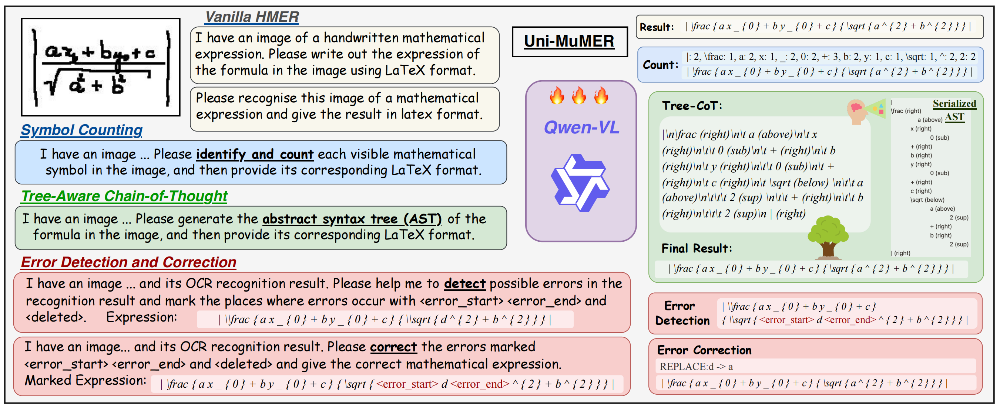
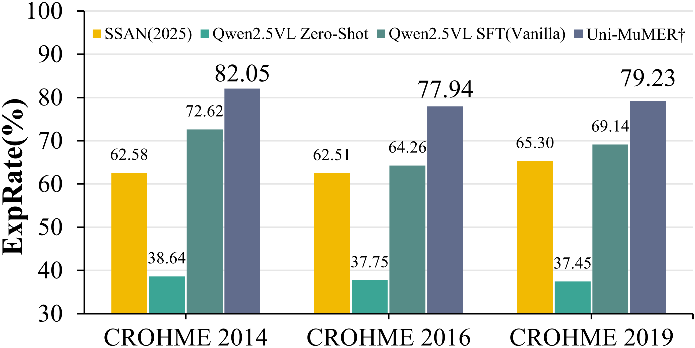

# Uni-MuMER: Unified Multi-Task Fine-Tuning of Vision-Language Model for Handwritten Mathematical Expression Recognition

<!-- ## 🏠 <a href="https://xxxx" target="_blank">Project Page</a> | <a href="https://arxiv.org/abs/xxxxx" target="_blank">Paper</a> | <a href="https://huggingface.co/xxxxx" target="_blank">Model Weights</a>  -->

<p align="center">
    <a href="https://arxiv.org/abs/2505.23566"></a>
    <!-- <a href="https://huggingface.co/collections/xxxx"></a> -->
</p>

<!-- [](https://arxiv.org/abs/24xxxx) -->


## Description
We introduce Uni-MuMER, which fully fine-tunes the Qwen2.5-VL-3B model for the HMER task without modifying its architecture, effectively injecting domain-specific knowledge into a generalist framework. Our method integrates three data-driven tasks: Tree-Aware Chain-of-Thought (Tree-CoT) for structured spatial reasoning, Error-Driven Learning (EDL) for reducing confusion among visually similar characters, and Symbol Counting (SC) for improving recognition consistency in long expressions. 




Experiments on the CROHME and HME100K datasets show that Uni-MuMER achieves new state-of-the-art performance, surpassing the best lightweight specialized model SSAN by 16.31% and the top-performing VLM Gemini2.5-flash by 24.42% in the zero-shot setting.




<!-- $$ -->


<!-- ## 📢 Updates -->


<!-- ## 


## 📦 Installation


## 🏋️ Training


## 🏃 Inference


## 🗃 Dataset -->


## ✅ TODO

- [ ] Inference code and pretrained models.
- [ ] Evaluation code.
- [ ] Training code.
- [ ] Training data.


## 🙏 Acknowledgements

Thanks to the following projects:

- [CoMER](https://github.com/Green-Wood/CoMER)
- [PosFormer](https://github.com/SJTU-DeepVisionLab/PosFormer)
- [TAMER](https://github.com/qingzhenduyu/TAMER)
- [LLaMA-Factory](https://github.com/hiyouga/LLaMA-Factory)


## 📝 Citation
If you find Uni-MuMER useful for your study or research, please cite our paper with:
```bibtex
@article{li2025unimumer,
  title = {Uni-MuMER: Unified Multi-Task Fine-Tuning of Vision-Language Model for Handwritten Mathematical Expression Recognition},
  author = {Li, Yu and Jiang, Jin and Zhu, Jianhua and Peng, Shuai and Wei, Baole and Zhou, Yuxuan and Gao, Liangcai},
  year = {2025},
  journal={arXiv preprint arXiv:2505.23566},
}

```


<!-- ## 📄 License -->


