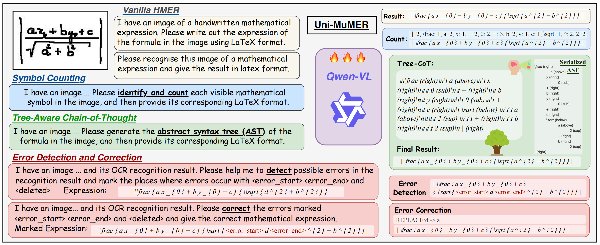
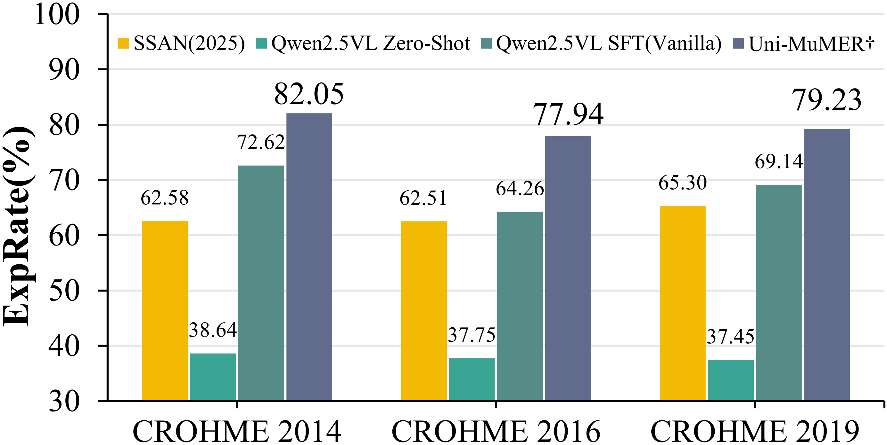

# Uni-MuMER: Unified Multi-Task Fine-Tuning of Vision-Language Model for Handwritten Mathematical Expression Recognition

<!-- ## 🏠 <a href="https://xxxx" target="_blank">Project Page</a> | <a href="https://arxiv.org/abs/xxxxx" target="_blank">Paper</a> | <a href="https://huggingface.co/xxxxx" target="_blank">Model Weights</a>  -->

<p align="center">
    <a href="https://arxiv.org/abs/2505.23566"></a>
    <a href="https://huggingface.co/collections/phxember/uni-mumer-68bfba4747e9289232f3d89e"></a>
</p>

<!-- [](https://arxiv.org/abs/24xxxx) -->


## Description
We introduce Uni-MuMER, which fully fine-tunes the Qwen2.5-VL-3B model for the HMER task without modifying its architecture, effectively injecting domain-specific knowledge into a generalist framework. Our method integrates three data-driven tasks: Tree-Aware Chain-of-Thought (Tree-CoT) for structured spatial reasoning, Error-Driven Learning (EDL) for reducing confusion among visually similar characters, and Symbol Counting (SC) for improving recognition consistency in long expressions. 

We further extend Uni-MuMER to newer backbone architectures (Qwen3.5 and Qwen3-VL) and provide a family of fine-tuned models for the community.




Experiments on the CROHME and HME100K datasets show that Uni-MuMER achieves new state-of-the-art performance, surpassing the best lightweight specialized model, SSAN, by 16.31% and the top-performing VLM Gemini2.5-flash by 24.42% in the zero-shot setting.



## 📢 Updates
- **2026-04-13**: Release 4 new model variants: Qwen3.5-2B, Qwen3.5-4B, Qwen3-VL-2B, Qwen3-VL-4B. [See Model Zoo](#model-zoo)
- **2026-03-29**: Release preprocessing scripts for UniMuMER-Tree, symbol-counting data construction, and the MathNet-based HMER prompt-data pipeline. [See Preprocessing](#preprocessing)
- **2025-09-18**: This work got accepted to NeurIPS 2025 as a Spotlight (688/21575).
- **2025-09-09** : Release dataset ([Uni-MuMER-Data](https://huggingface.co/datasets/phxember/Uni-MuMER-Data) and [valid/test data](https://drive.google.com/drive/folders/1T8a3WxICZVl1NJ99hu9tuuqqNZoxGhXq?usp=sharing)) and training code. [See Training](#training)
- **2025-06-02**: Release of model weights and inference scripts.

## 📦 Dataset Preparation

1. **Download** `data.zip` from GitHub, Huggingface, or [Google Drive link](https://drive.google.com/drive/folders/1T8a3WxICZVl1NJ99hu9tuuqqNZoxGhXq?usp=sharing).
2. **Unzip** it at the project root. After extraction, you should have:

```
data
├── CROHME/
├── CROHME2023/
├── HME100K/
├── Im2LaTeXv2/
├── MathWriting/
└── MNE/
```
<!--  -->

<a id="preprocessing"></a>

## 🛠 Preprocessing
We provide preprocessing scripts for the released UniMuMER-Tree and symbol-counting data construction pipeline in [`preprocess/`](./preprocess).

The current release includes:

- `tree`: generation of the UniMuMER-Tree supervision target from tokenized LaTeX
- `can`: generation of symbol-counting supervision paired with the corresponding LaTeX target
- `make_mathnet_hmer_data.py`: port of the MathNet-based caption cleaning and HMER prompt-data pipeline from `mathnet-ly/0410_proc_file.ipynb`
- `preprocess/MathNet4clean`: a pinned submodule for external MathNet preprocessing utilities and normalization reference code

The main entry points are:

```bash
python preprocess/make_unimumer_tree_data.py --task tree --input <input-json> --output <output-json>
```

```bash
python preprocess/make_mathnet_hmer_data.py process \
  --input <caption-txt-or-json> \
  --output-dir <output-dir> \
  --image-base-path <image-base-path> \
  --mathnet-root preprocess/MathNet4clean
```

For example:

```bash
python preprocess/make_unimumer_tree_data.py \
  --task tree \
  --input preprocess/examples/unimumer_tree/sample_input.json \
  --output preprocess/examples/unimumer_tree/sample_tree.json
```

Additional usage details, implementation notes, and ready-to-run examples are provided in [`preprocess/README.md`](./preprocess/README.md), [`preprocess/examples/unimumer_tree/`](./preprocess/examples/unimumer_tree), and [`preprocess/examples/mathnet_hmer/`](./preprocess/examples/mathnet_hmer).

For the MathNet-based preprocessing dependency, initialize submodules after cloning:

```bash
git submodule update --init --recursive
```

The Uni-MuMER-specific MathNet normalization path is implemented in
`preprocess/MathNet4clean/preprocessing/improve_tokens_unimumer.py`.

The MathNet HMER pipeline keeps the notebook-style intermediate outputs
(`step1` to `step9`, `invalid_record.json`, and `<output_dir>_0425_final.json`)
while replacing the original hard-coded external MathNet path with the in-repo
submodule.


## 🏃 Inference
After the dataset is in place, you can run **batch inference** over all three test sets with one of the two commands below.

### Shell wrapper (recommended)
```bash
bash eval/eval_crohme.sh  -i <input-dir> -o <output-dir> -m <model> -b <batch_size>
```
**Example**
```bash
bash eval/eval_all.sh -m models/Uni-MuMER-3B -s test1 -b 32768
```

### Direct Python call
```bash
python scripts/vllm_infer.py --input-dir <input-dir> --output-dir <output-dir> --model <model> --batch_size <batch_size>
```

 **Tip:** 
  - To select GPUs on multi‑GPU machines just export `CUDA_VISIBLE_DEVICES` before running the script, e.g., `export CUDA_VISIBLE_DEVICES=1,2`

  - For batch_size, you can use the `--batch_size` argument to control the number of samples per `vLLM.generate()` call. The default value is 32768, which is prevented from being too large to avoid OOM errors. 
<!-- $$ -->


## 📏 Evaluation Metrics
This repository currently provides text-based evaluation through
[`scripts/eval_metrics_calculator.py`](./scripts/eval_metrics_calculator.py),
including Edit Score, BLEU-4, CER, and exact-match rate.

We do **not** currently vendor the official CDM evaluator in this repository.
The `ExpRate@CDM` results reported in our paper follow the visually grounded
Character Detection Matching (CDM) protocol. As described in
[our paper](https://arxiv.org/abs/2505.23566), `ExpRate@CDM` is used as a
visual-equivalence-aware accuracy metric beyond exact string match.

For reproducing `ExpRate@CDM`, please use the official
[UniMERNet CDM toolkit](https://github.com/opendatalab/UniMERNet/tree/main/cdm).
The official implementation provides the evaluation entry point
`cdm/evaluation.py`, and our inference outputs already contain the core fields
(`gt`, `pred`, and `img_id`) expected by that evaluator.


## Model Zoo

| Model | Base | Params | Avg ExpRate | Avg CDM F1 | HuggingFace |
|-------|------|--------|-------------|------------|-------------|
| Uni-MuMER-Qwen2.5-VL-3B | Qwen2.5-VL-3B-Instruct | 3.4B | 72.19% | 0.9688 | [Link](https://huggingface.co/phxember/Uni-MuMER-Qwen2.5-VL-3B) |
| Uni-MuMER-Qwen2.5-VL-7B | Qwen2.5-VL-7B-Instruct | 8.3B | - | - | [Link](https://huggingface.co/phxember/Uni-MuMER-Qwen2.5-VL-7B) |
| Uni-MuMER-Qwen3.5-2B | Qwen3.5-2B | 2.2B | **73.09%** | 0.9700 | [Link](https://huggingface.co/phxember/Uni-MuMER-Qwen3.5-2B) |
| Uni-MuMER-Qwen3.5-4B | Qwen3.5-4B | 4.5B | 71.60% | **0.9701** | [Link](https://huggingface.co/phxember/Uni-MuMER-Qwen3.5-4B) |
| Uni-MuMER-Qwen3-VL-2B | Qwen3-VL-2B-Instruct | 2.1B | 72.49% | 0.9692 | [Link](https://huggingface.co/phxember/Uni-MuMER-Qwen3-VL-2B) |
| Uni-MuMER-Qwen3-VL-4B | Qwen3-VL-4B-Instruct | 4.4B | 72.11% | 0.9688 | [Link](https://huggingface.co/phxember/Uni-MuMER-Qwen3-VL-4B) |

> **Note**: Qwen3.5 models require `transformers >= 5.0.0`. Qwen3-VL models use the `qwen3_vl_nothink` template; Qwen3.5 models use `qwen3_5_nothink`.

## Benchmark Results

### ExpRate (Exact Match Rate) on Main Test Sets

| Dataset | Samples | Uni-MuMER-3B | Qwen3.5-2B | Qwen3.5-4B | Qwen3-VL-2B | Qwen3-VL-4B |
|---------|---------|:------------:|:----------:|:----------:|:-----------:|:-----------:|
| CROHME 2014 | 986 | 82.25% | **83.98%** | 82.56% | 83.27% | 82.35% |
| CROHME 2016 | 1,147 | 78.29% | **81.17%** | 78.20% | 78.55% | 79.34% |
| CROHME 2019 | 1,199 | 79.82% | **80.15%** | 75.98% | 79.40% | 78.98% |
| CROHME 2023 Test | 2,300 | 69.52% | 69.43% | 66.74% | **70.96%** | 69.17% |
| HME100K Test | 24,607 | 69.50% | **70.43%** | 70.02% | 69.31% | 69.79% |
| Im2LaTeXv2 Test | 10,118 | 76.99% | **77.82%** | 77.20% | 77.11% | 77.46% |
| MathWriting Test | 7,643 | 53.03% | 51.84% | **54.32%** | 50.66% | 53.15% |
| MNE-N1 | 1,875 | 75.89% | 74.72% | 69.76% | **79.63%** | 70.51% |
| MNE-N2 | 304 | 57.89% | 61.18% | 54.93% | **65.13%** | 52.96% |
| MNE-N3 | 1,464 | 46.72% | **56.83%** | 56.69% | 52.39% | 54.44% |
| **Average** | | 72.19% | **73.09%** | 71.60% | 72.49% | 72.11% |

### CDM Metrics (Visual-Equivalence-Aware)

| Dataset | Uni-MuMER-3B | Qwen3.5-2B | Qwen3.5-4B | Qwen3-VL-2B | Qwen3-VL-4B |
|---------|:------------:|:----------:|:----------:|:-----------:|:-----------:|
| CROHME 2014 | 0.9660 | 0.9690 | **0.9730** | 0.9700 | 0.9660 |
| CROHME 2016 | 0.9620 | **0.9690** | 0.9640 | 0.9660 | 0.9670 |
| CROHME 2019 | **0.9710** | 0.9690 | **0.9710** | 0.9700 | 0.9700 |
| HME100K Test | 0.9710 | **0.9720** | **0.9720** | 0.9710 | 0.9710 |
| Im2LaTeXv2 Test | **0.9950** | **0.9950** | 0.9930 | 0.9940 | **0.9950** |
| MathWriting Test | 0.9550 | 0.9510 | **0.9580** | 0.9480 | 0.9520 |
| **Average F1** | 0.9688 | 0.9700 | **0.9701** | 0.9692 | 0.9688 |

> Evaluation: vLLM 0.19.0, temperature=0.2, max_tokens=2048. CDM computed with [UniMERNet/cdm](https://github.com/opendatalab/UniMERNet/tree/main/cdm).


<a id="training"></a>

## Training
Our training code depends on [LLaMA-Factory](https://github.com/hiyouga/LLaMA-Factory).

For training dependencies, please refer to [LLaMA-Factory](https://github.com/hiyouga/LLaMA-Factory) or requirements_training.txt.

### Uni-MuMER-3B (Qwen2.5-VL-3B, original)

```bash
llamafactory-cli train train/Uni-MuMER-train.yaml
```

### New Model Variants (Qwen3.5 / Qwen3-VL)

Training configs for newer backbones are provided in `train/`:

```bash
# Qwen3.5 models (requires transformers >= 5.0.0)
llamafactory-cli train train/Uni-MuMER-Qwen3.5-2B.yaml
llamafactory-cli train train/Uni-MuMER-Qwen3.5-4B.yaml

# Qwen3-VL models
llamafactory-cli train train/Uni-MuMER-Qwen3-VL-2B.yaml
llamafactory-cli train train/Uni-MuMER-Qwen3-VL-4B.yaml
```

**Key differences from the original 3B config:**
- Qwen3.5 models use template `qwen3_5_nothink`; Qwen3-VL models use `qwen3_vl_nothink`
- All new models use DeepSpeed ZeRO-3 (required for 8x A100 80GB)
- `transformers >= 5.0.0` is required for Qwen3.5 architecture support
- Qwen3.5 and Qwen3-VL use different tokenizers; their tokenized caches are **not interchangeable**


<!-- ## 📢 Updates -->


<!-- ## 


## 📦 Installation


## 🗃 Dataset -->


## ✅ TODO
- [x] Inference code and pretrained models.
- [x] Evaluation code.
- [x] Training code.
- [x] Training data.
- [x] Preprocess code.


## 🙏 Acknowledgements

Thanks to the following projects:

- [CoMER](https://github.com/Green-Wood/CoMER)
- [PosFormer](https://github.com/SJTU-DeepVisionLab/PosFormer)
- [TDv2](https://github.com/yqingli123/TDv2)
- [TAMER](https://github.com/qingzhenduyu/TAMER)
- [LLaMA-Factory](https://github.com/hiyouga/LLaMA-Factory)
- [MathNet](https://github.com/felix-schmitt/MathNet)


## 📝 Citation
If you find Uni-MuMER useful for your study or research, please cite our paper with:
```bibtex
@article{li2025unimumer,
  title = {Uni-MuMER: Unified Multi-Task Fine-Tuning of Vision-Language Model for Handwritten Mathematical Expression Recognition},
  author = {Li, Yu and Jiang, Jin and Zhu, Jianhua and Peng, Shuai and Wei, Baole and Zhou, Yuxuan and Gao, Liangcai},
  year = {2025},
  journal={arXiv preprint arXiv:2505.23566},
}

```


<!-- ## 📄 License -->
