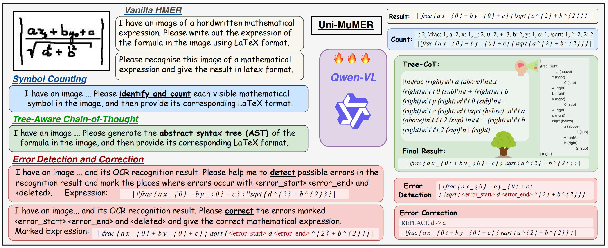

# Uni-MuMER: Unified Multi-Task Fine-Tuning of Vision-Language Model for Handwritten Mathematical Expression Recognition

<!-- ## 🏠 <a href="https://xxxx" target="_blank">Project Page</a> | <a href="https://arxiv.org/abs/xxxxx" target="_blank">Paper</a> | <a href="https://huggingface.co/xxxxx" target="_blank">Model Weights</a>  -->

<p align="center">
    <a href="https://arxiv.org/abs/2505.23566"></a>
    <a href="https://huggingface.co/phxember/Uni-MuMER-Qwen2.5-VL-3B"></a>
</p>

<!-- [](https://arxiv.org/abs/24xxxx) -->


## Description
We introduce Uni-MuMER, which fully fine-tunes the Qwen2.5-VL-3B model for the HMER task without modifying its architecture, effectively injecting domain-specific knowledge into a generalist framework. Our method integrates three data-driven tasks: Tree-Aware Chain-of-Thought (Tree-CoT) for structured spatial reasoning, Error-Driven Learning (EDL) for reducing confusion among visually similar characters, and Symbol Counting (SC) for improving recognition consistency in long expressions. 




Experiments on the CROHME and HME100K datasets show that Uni-MuMER achieves new state-of-the-art performance, surpassing the best lightweight specialized model SSAN by 16.31% and the top-performing VLM Gemini2.5-flash by 24.42% in the zero-shot setting.


## 📢 Updates


- **2025-06-02**: Release of model weights and inference scripts.

## 📦 Dataset Preparation

1. **Download** `data.zip` from github or huggingface.
2. **Unzip** it at the project root. After extraction you should have:

```
data/
├─ CROHME/   # CROHME dataset
  ├─ 2014/   # 986 expressions
  ├─ 2016/   # 1 147 expressions
  └─ 2019/   # 1 199 expressions
```
<!--  -->


## 🏃 Inference
After the dataset is in place you can run **batch inference** over all three test sets with one of the two commands below.

Shell wrapper (recommended)
```bash
bash eval/eval_crohme.sh  -i <input-dir> -o <output-dir> -m <model>

```
Direct Python call
```bash
python scripts/vllm_infer.py --input-dir <input-dir> --output-dir <output-dir> --model <model>
```

 **Tip:** To select GPUs on multi‑GPU machines just export `CUDA_VISIBLE_DEVICES` before running the script, e.g. `export CUDA_VISIBLE_DEVICES=1,2`.

<!-- $$ -->


<!-- ## 📢 Updates -->


<!-- ## 


## 📦 Installation


## 🏋️ Training


## 🗃 Dataset -->


## ✅ TODO
- [x] Inference code and pretrained models.
- [ ] Evaluation code.
- [ ] Training code.
- [ ] Training data.
- [ ] Preprocess code.


## 🙏 Acknowledgements

Thanks to the following projects:

- [CoMER](https://github.com/Green-Wood/CoMER)
- [PosFormer](https://github.com/SJTU-DeepVisionLab/PosFormer)
- [TAMER](https://github.com/qingzhenduyu/TAMER)
- [LLaMA-Factory](https://github.com/hiyouga/LLaMA-Factory)


## 📝 Citation
If you find Uni-MuMER useful for your study or research, please cite our paper with:
```bibtex
@article{li2025unimumer,
  title = {Uni-MuMER: Unified Multi-Task Fine-Tuning of Vision-Language Model for Handwritten Mathematical Expression Recognition},
  author = {Li, Yu and Jiang, Jin and Zhu, Jianhua and Peng, Shuai and Wei, Baole and Zhou, Yuxuan and Gao, Liangcai},
  year = {2025},
  journal={arXiv preprint arXiv:2505.23566},
}

```


<!-- ## 📄 License -->


